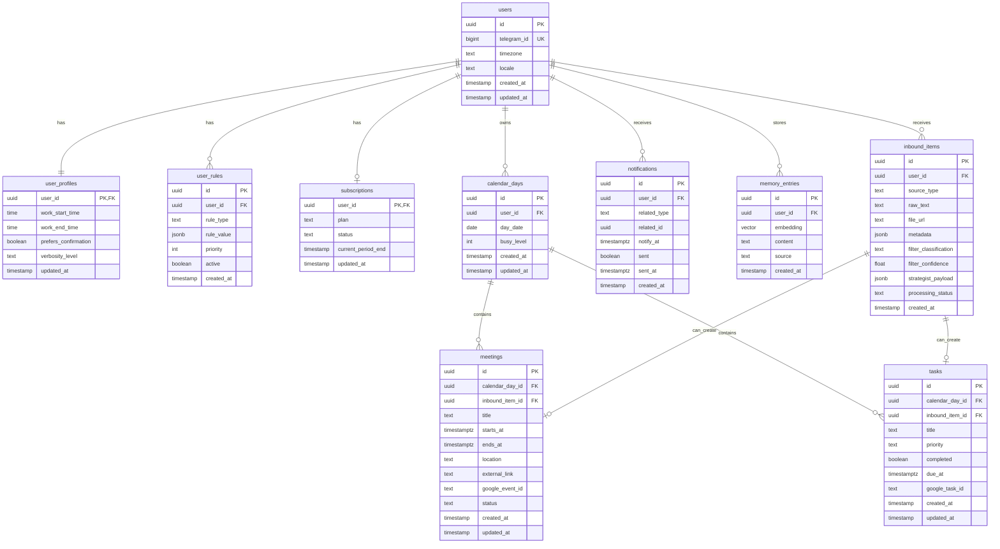

# ER Diagram

## Notes
- `inbound_items` хранит вход и решения агентов для аудита и переигрывания.
- `calendar_days.busy_level` можно считать периодически по сумме встреч и весам задач.
- `notifications.related_type + related_id` дают универсальную связь на `task/meeting`.
